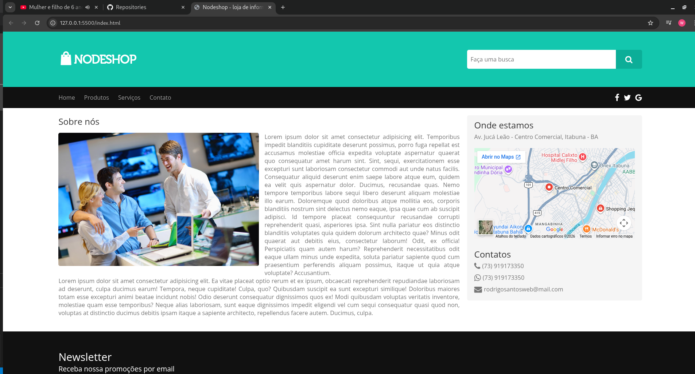
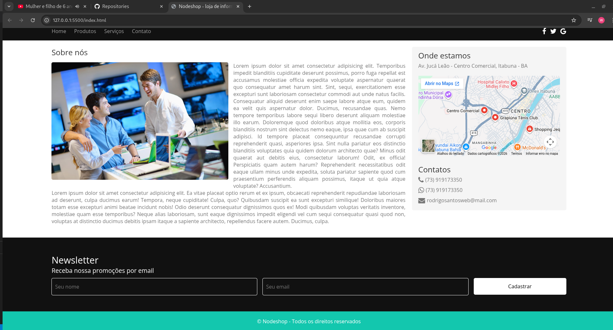

        

# Nodeshoop
Site nodeshop curso nodestudio treinamentos

## Assunto
Desenvolver uma simples **lading page** de um comércio de informática. Conta com logo, menu, conteúdo principal, conteúdo lateral, newsletter e rodapé.

### screenshot

